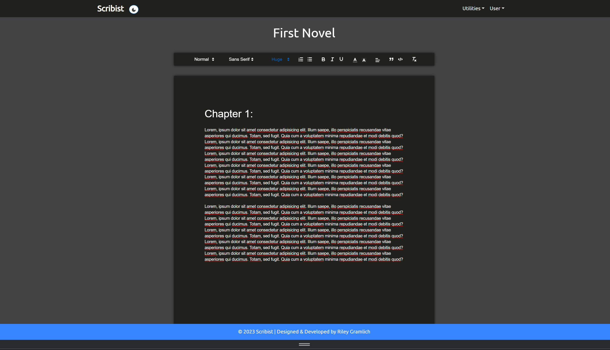
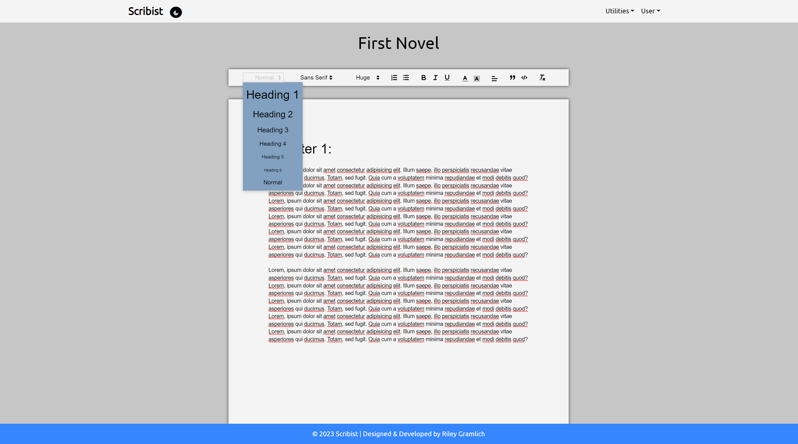
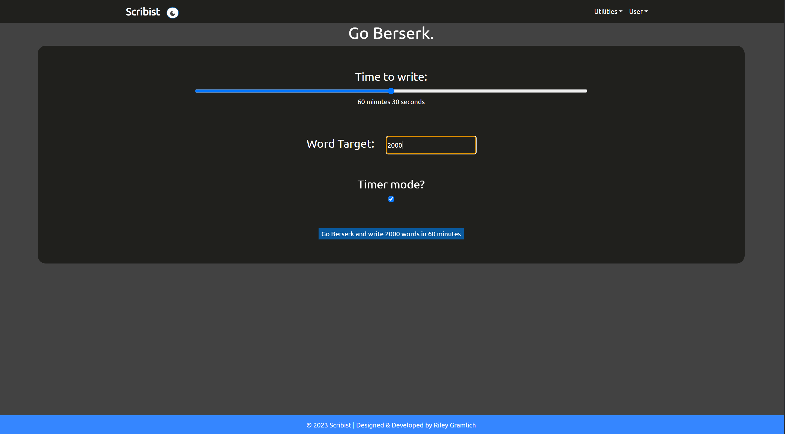
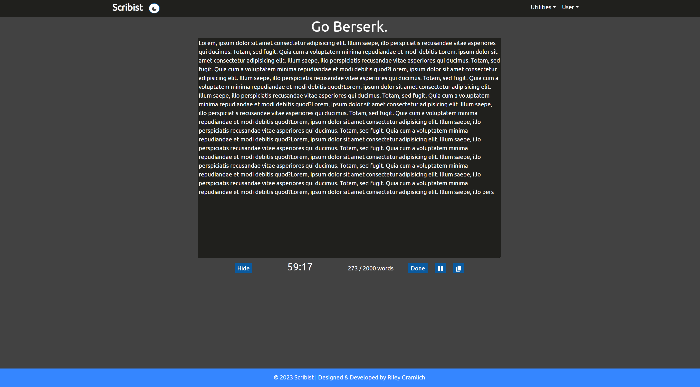
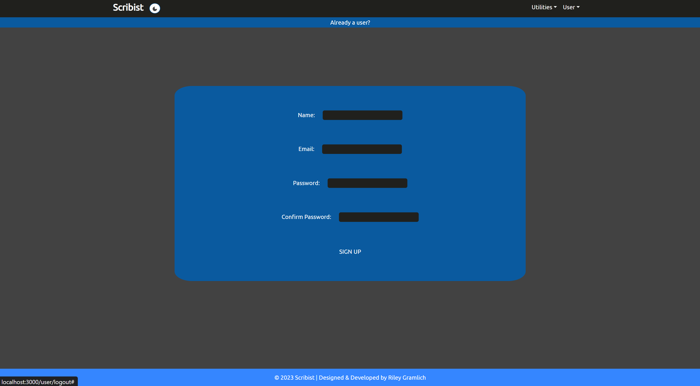
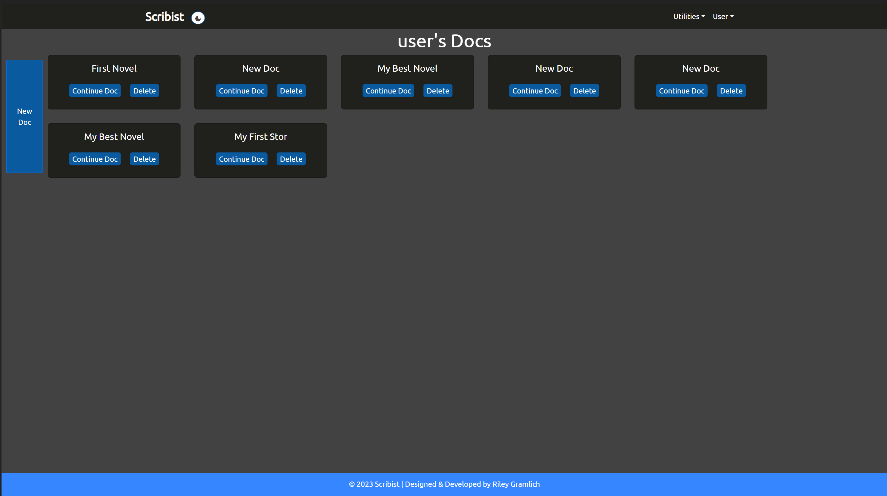

# Scribist
### A writing app with editing features, Berserk Mode writing, and testing your typing speed.
#### By [rileygramlich](https://github.com/rileygramlich)
---
[Click to use Scribist!](https://scribist.herokuapp.com/)

## Description and Background Info:
This utility app is built with the intention of helping people write more, especially with Berserk mode which allows you to pressure yourself with a word target and a timer set to reach that target.

### Create and Edit Docs:
Create new documents for writing stories, or essays, or anything. This doc editor autosaves your work every 2 seconds. Also, if you want to collaborate with a friend on the document, just shoot them the link and you can see each other's changes appear live.

### Berserk Mode:
The purpose of this feature is to encourage your to have a continuous flow of writing. Berserk mode allows you to set a word target and a timer for how long you have to write targeted amount of words.  The cool thing about this mode is that if you stop typing, it will start erasing your words! The buffer time before it's starts erasing is set to 2 seconds. So go berserk and don't stop writing!

<!-- ### Typing Test:

 -->

## Screenshots:
Of Authorization Page:

Of All Docs Page:

## Technologies Used:
The MERN (MongoDB, Express, React.js Node.js) stack was used to develop this full-stack web application.

* [MongoDB](https://www.mongodb.com/): used to deploy a live cloud server to store data in a database. User model with mongoose referencing for the known and known words (many to many), and mongoose embedding for the posts (one to many).

* [Express](https://expressjs.com/): used for handling all of the back-end operations (routing, schema data manipulation, and so on).

* [React.js](https://reactjs.org/): UI JavaScript Library. [more here]

* [Node.js](https://nodejs.org/en/): used as the live server environment, to monitor server operations, and view the web-app in a browser when running nodemon.

<!-- * [Google People API](https://console.cloud.google.com/): used as a third party API to make Oauthentication with Google possible and bring in Google user data. -->

* Javascript: used constantly throughout the application to write functions and manipulate the data accordingly.

* CSS (including bootstrap and materialize libraries): used to style the app and make it look clean and pretty.

* [Github](https://github.com/): used for version control.

* [VSCode Editor](https://code.visualstudio.com/): used to write and code and manage file locations.

<!-- * [Railway](https://railway.app/): used for deploying the app for others to use. Use now: [link to app] -->

* [Trello](https://trello.com/u/rileygramlich1/boards): was used for making a do list list and managing tasks to get done.

* [Lucid](https://lucid.app/documents): used to create an initial ERD (environment relationship diagram.

* [Figma](): used to create the original wireframe.

* Markdown: used to create this README.md

* Google Chrome and its developer tools was used to test the app during production.

## Getting Started: 

### Demo:
[Click to write your dream project now!](https://scribist.herokuapp.com/)

## Planned future enhancements:
1. Add edit sections feature whereby you can drag and move a given section and it will re-render it on the Quill editor
2. Add more consequences in Berserk Mode, for example have the screen turn crazy colors, or have it blast sounds at you.
3. Sign in with Google Oauth, Github, or Facebook.
4. Add ability to convert the doc various formats such as PDF, markdown, or html.
5. Implement more on the about page and add donation option using Stripe.
6. Style more and add animations and use a library like framer to have seamless popup interactivity.
7. Add Ability to see more data about docs (words typed, created date, last updated, etc).
8. Add search option in navbar to find docs faster.
9. Add note-taking feature that can do todos (without all the text editing).
10. Integrate ChatGPT API to aid for writing prompts and generating outlines.
