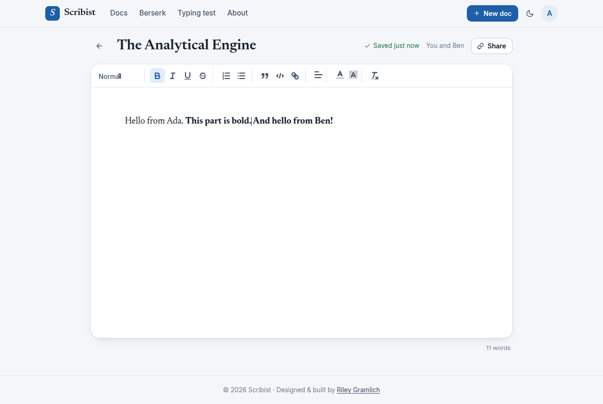
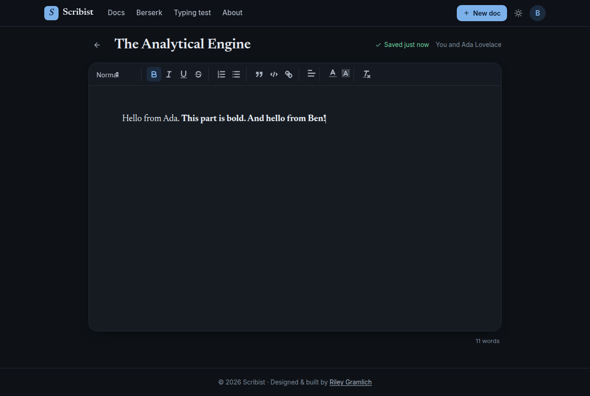
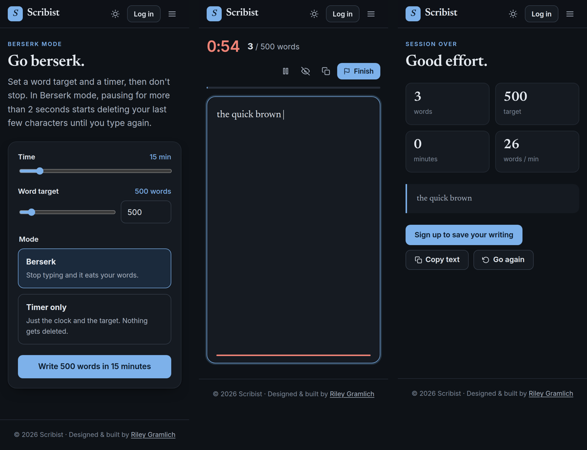

# Scribist
### A writing room: docs you can edit together live, Berserk Mode for getting words down, and a typing test.

#### By [rileygramlich](https://github.com/rileygramlich)



## What it does

### Docs, together
Rich-text documents (headings, lists, quotes, code, links, colour) set in [Newsreader](https://fonts.google.com/specimen/Newsreader). They save themselves a second after you stop typing, and the status next to the title says so: *Saving… → Saved just now*, or *Offline, reconnecting…* if the connection drops. Unsaved edits are kept and sent when it comes back.

To write with someone, click **Share** and send them the link. Once they're signed in, you'll see each other's changes as you type and who else is in the doc. The link carries a random share token, so docs can't be opened by guessing their address. Only the owner can delete a doc; collaborators can leave it.



### Berserk Mode
Set a timer and a word target, then don't stop. In **Berserk** mode, pausing for more than 2 seconds starts deleting your last few characters every 2 seconds until you type again, and a red bar warns you as the grace period runs out. **Timer only** mode keeps the clock and the target but never deletes. You can pause (the clock and the eraser both stop), hide the stats to focus, and at the end save the session as a doc or copy it. It works without an account; if you sign up from the results screen, the writing is saved to your new account.



### Typing test
Type a quote. The clock starts on your first key, each character is marked right or wrong as you go, and you get words per minute and accuracy at the end.

Light and dark themes follow your system, and the moon/sun button switches them (remembered per browser).

## Running it locally

Node 22 and MongoDB (Docker is quickest):

```bash
npm install
cp .env.example .env
docker run -d --name scribist-mongo -p 27017:27017 mongo:7
npm run dev        # API + sockets on :3001, the site on http://localhost:5173
```

`npm run preview` builds the site and serves everything from `node server.js` on :3001, which is how it runs in production.

### Environment

| Variable | |
|---|---|
| `DATABASE_URL` | MongoDB connection string. Defaults to `mongodb://127.0.0.1:27017/scribist`. |
| `SECRET` | Signs the login tokens (JWTs). Required in production. |
| `GOOGLE_CLIENT_ID` | Optional. Shows "Continue with Google". Add the site's address to the OAuth client's **Authorized JavaScript origins**. |

## Deploying

Scribist is one Node process that serves the built site, the API and Socket.IO. Live collaboration needs a host that keeps that process running with WebSockets, which serverless hosts like Vercel don't do.

**Heroku** (GitHub Student Developer Pack: $13/month of credit for 24 months, enough for an always-on Basic dyno): create an app, connect this repo, and set `DATABASE_URL`, `SECRET` (`openssl rand -hex 32`) and optionally `GOOGLE_CLIENT_ID` under Settings → Config Vars. The `Procfile` runs `npm start`, and Heroku runs `npm run build` on each deploy.

**Render** (free, but sleeps after 15 idle minutes): New → Blueprint → this repo. `render.yaml` sets everything up and generates `SECRET`; paste `DATABASE_URL` when asked.

**Database:** a free MongoDB Atlas cluster works. Allow `0.0.0.0/0` under Network Access, since these hosts have no fixed IP address. `GET /api/health` reports whether the app can reach it, and why not.

## How it's built

MERN: MongoDB, Express 5, React 19 and Node.js, with [Quill 2](https://quilljs.com/) for the editor and [Socket.IO](https://socket.io/) for live editing. Vite builds the front end; the styling is hand-written CSS with light and dark themes, set in Newsreader and Inter.

```
server.js              Express: the API, Socket.IO and the built site, all on one origin
ioManager.js           live editing: authenticated sockets, one room per doc, presence, saves
config/                database (with reconnects), JWT auth
models/                User (password or Google), Doc (owner, collaborators, share token)
controllers/ routes/   /api/users (sign up, log in, Google), /api/docs
src/                   React: pages/ (Doc, Berserk, TypeTest, Home, Auth, About), components/, lib/, styles/
```

Auth is a JWT in `localStorage`, sent as a Bearer header to the API and in the socket handshake. It carries only the user's id, name and email.
